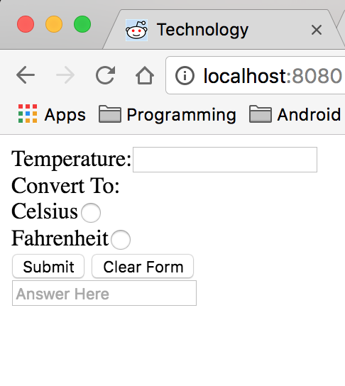
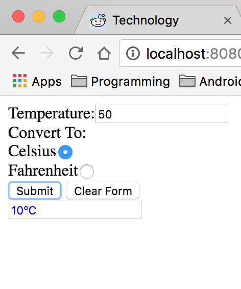

#Converter


## Description
In this exercise I have an input field, a checkbox for farenheit or celsius and a submit button. In this project I take the input from the user and convert the value based on the checkbox the user selects.

## How to run
In your terminal run:
```
http-server -p 9999
```
then navigate to http://localhost:9999 in your browser.

## Screenshots
##On Page Load

##On User Input


## Contributors
- [Justin Leggett](https://github.com/justinal64)